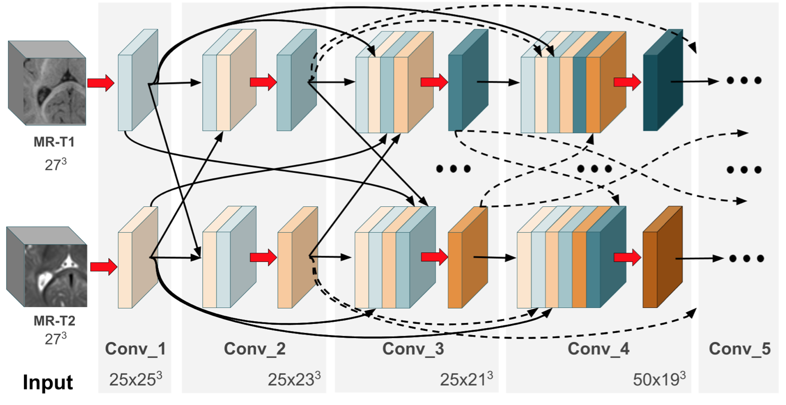

# Hyperdensenet_Pytorch


This is a Pytorch implementation of Hyperdensenet. For the detailed architecture please refer to the original paper: [link](https://arxiv.org/abs/1804.02967)

This is not the original implementation of the paper (Do not use it to reproduce the results). The original code is based on Theano and can be found [here](https://github.com/josedolz/HyperDenseNet)

### Design of the Proposed Model


### Dependencies
This code depends on the following libraries:

- Python >= 3.5
- Pytorch 0.3.1 (Testing on more recent versions)
- nibabel
- medpy


### Training

The model can be trained using below command:  
```
python mainHyperDenseNet.py
```

## Preparing your data
- To use your own data, you will have to specify the path to the folder containing this data (--root_dir).
- Images have to be in nifti (.nii) format
- You have to split your data into two folders: Training/Validation. Each folder will contain N sub-folders: N-1 subfolders that will contain each modality and GT, which contain the nifti files for the images and their corresponding ground truths. 
- In the runTraining function, you have to change the name of the subfolders to the names you have in your dataset (lines 128-131 and 144-147).

## Current version
- The current version includes HyperDenseNet for 2 and 3 modalities. As it is, the code runs the training for 3 modalities. We are working on making the code easier to quickly change between 2 and 3 (or more) modalities. If you cannot wait and want to use the 2-versions architecture, you can simply remove the the third folder from loading or sampling operations (i.e., moda_3_val) and call the model 'HyperDenseNet_2Mod' instead of the model 'HyperDenseNet' 
- Patch size, and sampling steps values are hard-coded. We will work on a generalization of this, allowing the user to decide the input patch size and the frequency to sample the patches.
- Only one subject is employed for validation (in the inference.py function). We are working on generalizing this function to N subjects and creating an additional testing function.

If you use this code in your research, please consider citing the following paper:

Dolz J, Gopinath K, Yuan J, Lombaert H, Desrosiers C, Ayed IB. HyperDense-Net: A hyper-densely connected CNN for multi-modal image segmentation. IEEE transactions on medical imaging. 2018 Oct 30;38(5):1116-26.

# HyperDenseNet_pytorch
